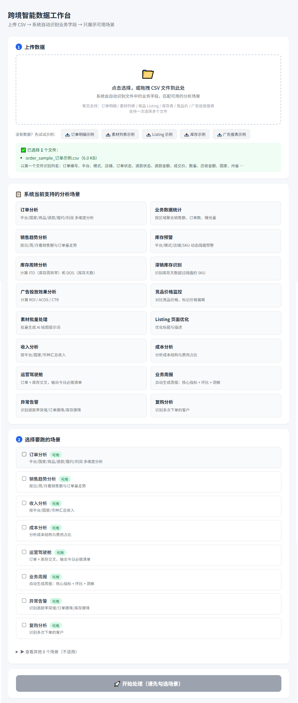
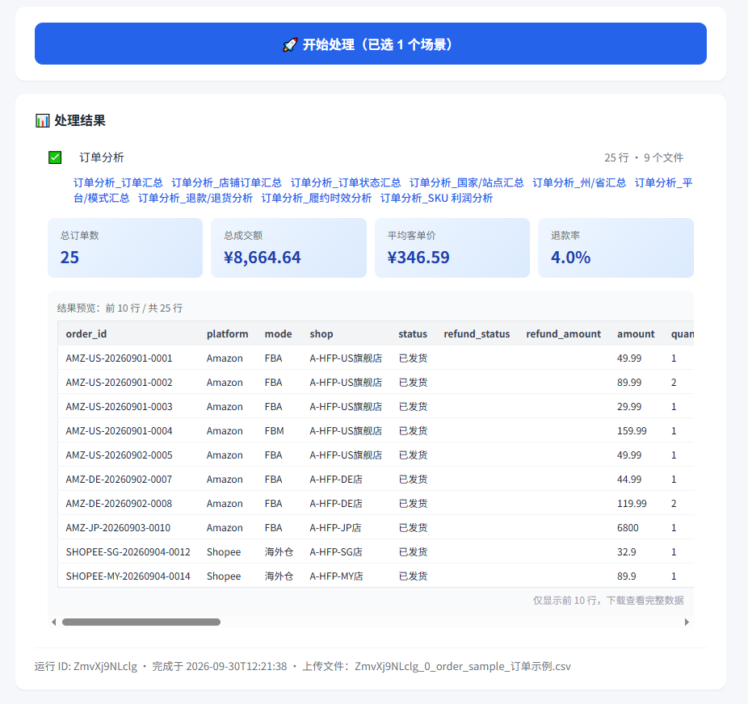

# 跨境智能数据工作台 | Cross-Border AI Data Site

> 面向跨境电商中小卖家的 AI 数据分析站点。覆盖**订单 / 库存 / 营销 / 财务 / 决策 / 客户**六大类业务，**16 个分析场景**，一次上传 CSV，一键得到业务洞察。

[](https://www.python.org/)
[](https://fastapi.tiangolo.com/)
[](LICENSE)

---

## ✨ 项目亮点

- **业务闭环**：16 个场景覆盖跨境电商日常运营（看盘 → 素材 → 上架 → 备货 → 定价 → 投放 → 财务 → 决策）
- **字段驱动**：上传任意列名的 CSV，系统自动识别业务字段
- **多文件上传**：一次上传多个文件，每个场景自动匹配对应文件
- **多币种支持**：USD / EUR / JPY / SGD / MYR / CNY 自动折算
- **结果可视化**：预览表格 + 关键指标卡片，不用下载就能看结果
- **移动端适配**：手机 / 平板也能看
- **业务人员零门槛**：打开网页 → 拖入 CSV → 点按钮 → 下载结果
- **可扩展**：新增场景只需 3 步（写插件 + 加契约 + 加 import）

---

## 📸 系统截图

### 上传与场景匹配



### 结果可视化（关键指标卡片 + 预览表格）



---

## 🎯 16 个分析场景

| 类别 | 场景 | 输入 | 输出 |
|---|---|---|---|
| **销售** | 订单分析 | 订单表 | 11 份下钻报告 |
| | 销售趋势分析 | 订单表 | 日/月销售趋势 + 环比 |
| | 业务数据统计 | 店铺数据 | 按区域聚合销售额、转化率 |
| **库存** | 库存预警 | 库存表 | 4 份报告（动态阈值 + 行动建议） |
| | 库存周转分析 | 库存表 | ITO 周转率 + DOS 库存天数 |
| | 滞销库存识别 | 库存表 | 库存天数超阈值的 SKU 清单 |
| **营销** | 广告投放效果分析 | 广告表 | ROI / ACOS / CTR |
| | 竞品价格监控 | 竞品表 | 价格偏离预警 |
| | 素材批量处理 | 素材表 | 批量生成 AI 绘图提示词 |
| | Listing 页面优化 | 商品表 | 优化标题 + 描述 |
| **财务** | 收入分析 | 订单表 | 按平台/国家/币种汇总 |
| | 成本分析 | 订单表 | 成本结构 + 毛利 + 毛利率 |
| **决策** | 运营驾驶舱 | 订单 + 库存 | 今日必做清单 |
| | 业务周报 | 订单表 | 本周 vs 上周环比 |
| | 异常告警 | 订单表 | 退款率突增 / 订单骤降 |
| **客户** | 复购分析 | 订单表 | 客户分层 |

---

## 🚀 快速开始

### Windows

打开项目根目录，双击以下文件：

- `setup.bat` -- 安装依赖（首次运行）
- `api.bat` -- 启动服务

浏览器打开：http://localhost:8000/app

### macOS / Linux

在终端执行：

```
pip install -r requirements.txt
python scripts/api.py
```

### 使用流程

1. 打开 http://localhost:8000/app
2. 上传 CSV（支持多文件）
3. 系统自动识别业务字段，展示**可用场景**（不适用场景折叠）
4. 勾选需要的场景
5. 点击「开始处理」
6. **页面直接预览结果**（前 10 行 + 关键指标）
7. 下载完整结果 CSV

---

## 🏗️ 架构设计

系统分 5 层：

1. **L5 决策层**：运营驾驶舱 / 业务周报 / 异常告警
2. **L4 分析层**：16 个场景
3. **L3 领域层**：6 大业务对象（Order / Product / SKU / Inventory / Customer / Channel）
4. **L2 接入层**：字段字典 / 场景契约
5. **L1 基础层**：IO / 日志 / 异常 / 币种处理

### 核心机制：字段驱动

- `config/field_dictionary.yaml`：业务字段 → 同义词映射
- `config/scenario_contracts.yaml`：每个场景需要的字段
- 上传任意 CSV：系统自动匹配字段

举例：文件里叫「销售额」「sales」「成交价」「amount」，系统都识别为同一个字段。

---

## 📁 目录结构

```
cross-border-ai-data-site/
├── config/                     配置
│   ├── config.yaml             主配置
│   ├── field_dictionary.yaml   业务字段字典
│   ├── scenario_contracts.yaml 场景契约
│   └── currency_rates.yaml     汇率表
├── data/                       示例数据
├── docs/                       文档
│   └── screenshots/            系统截图
├── scripts/                    入口脚本
├── src/
│   ├── api/                    FastAPI 应用
│   │   ├── routers/            API 路由
│   │   └── static/             前端页面
│   └── cross_border_ai/        核心业务包
│       ├── domain/             领域层（6 大对象）
│       ├── plugins/            16 个场景插件
│       ├── coze_workflow/      Coze 资产版本化
│       └── field_mapper.py     字段映射引擎
├── tests/                      测试
├── output/                     输出目录
└── README.md
```

---

## 🧪 测试

在项目根目录执行：

```
pytest
```

---

## 📖 文档

- [架构说明](docs/architecture.md)
- [业务价值](docs/business_value.md)
- [Coze 迁移说明](docs/coze_migration.md)
- [业务人员维护指南](docs/maintenance_guide.md)
- [更新日志](CHANGELOG.md)

---

## 🔧 扩展开发

### 新增场景（3 步）

1. **写插件**：在 `src/cross_border_ai/plugins/` 新建 `xxx.py`，用 `@register_scenario("xxx")` 装饰
2. **加契约**：在 `config/scenario_contracts.yaml` 加一条声明
3. **注册**：在 `plugins/__init__.py` 加 `import`

**不用改前端、不用改 API。**

### 新增字段 / 同义词

只改 `config/field_dictionary.yaml`。

---

## 📌 路线图

- [x] V1：本地脚本（三大场景）
- [x] V2：工程化重构（模块化 + 异常处理）
- [x] V3.0.0：16 场景 + 6 业务对象 + 币种处理
- [x] V3.0.1：多文件上传修复 + 字段字典完善
- [x] V3.0.2：结果可视化 + 关键指标卡片 + 移动端适配
- [ ] V3.1：历史记录（SQLite）
- [ ] V3.2：上传进度条 + 更多可视化
- [ ] V4.0：定时任务 + API 接入 ERP
- [ ] V5.0：多租户 + 用户体系

---

## 📄 License

MIT

---

## 👤 Author

**xieyn9988** · https://github.com/xieyn9988
